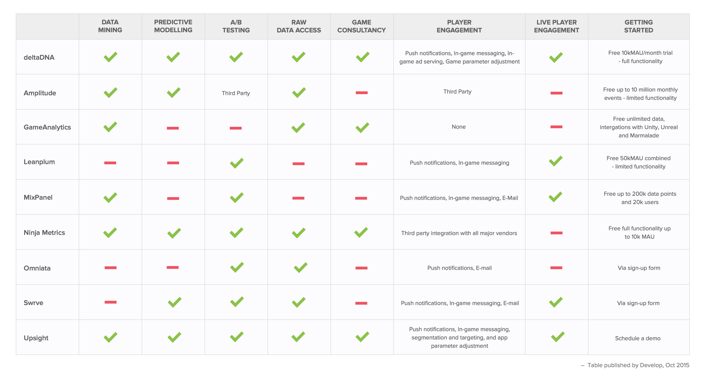

# Game Analytics platform comparison table
> https://deltadna.com/blog/game-dev-tools-analytics-compared/ 를 번역 
> deltaDNA에서 작성한 문서이므로 다분히 편향적.

- Free-to-Play (F2P) 또는 Freemium 게임을 개발했다면 그 게임이 잘되고 있는지 아는것이 중요하다. 그러나 설치 횟수 나 플레이어 수에 대한 통계만으로는 게임이 성공적인지 알 수 없다. 
- 게임에서 수익을 발생하는가? 유저들은 재미를 느끼고 있는가? 이러한 성공 요인을 확인하려면 더 많은 정보가 필요하다. 
- 게임을 런칭하고 나면, 유저들의 패턴에 따라 밸런싱을 계속해야한다. 이것이 분석플랫폼이 필요한 이유임.

### Analytics platform 선택하기

- 어떤 플랫폼을 선택 할것인가?
	- 게임데이터를 분석하고 인사이트를 얻기위한 서로 다른 기술 팩터를 지닌 다양한 플랫폼이 있다.
	- 주요 풀랫폼들을 대상으로 독립적인 분석의 결과 이다. 

    

#### Data Mining 
데이터 마이닝은 적용가능한 인사이트를 뽑아내기 위해 많은 양의 데이터를 통해 분석을 수행 한다. 게임에 효과 적인 변화를 주기 위해서는 데이터 수집의 정확성이 중요하다.

- ##### Why use this? 
데이터 마이닝을 통해 플레이어의 행동과 플레이어가 게임과 상호 작용하는 방식을 이해할 수 있다. 
플레이어들의 행동 패턴을 그룹핑하여 여러 세그먼트로 나누고 각 플레이어 세그먼트에 대한 경험을 개선하기위해 목표를 설정할 수 있다. 데이터마이닝을 통해 정확한 세그먼트를 얻을 수 있다.

#### Predictive Modeling
데이터를 이용하여 플레이어의 행동을 예측하는 통계 모델을 만드는 프로세스

- ##### Why use this? 
플레이어 행동을 예측하면 플레이어의 획득 채널을 정확하게 평가하는 데 도움이 된다. 예를 들어 사용자가 원치 않는 행동에 대응하여 개입 할 수 있고, 이탈방지가 가능하다.

#### A/B Testing
게임의 변수를 변경해야하거나 한 변수의 두 가지 버전을 결정해야 할 때 A / B 테스트 도구를 사용하여 어느 것이 가장 효과적인 선택인지 판단 할 수 있다. 이 도구는 두 버전을 서로 비교하여 원하는 결과를 기반으로 정량적으로 측정한다.

- ##### Why use this? 
성공을 위해 게임의 모든 측면을 최적화하는 것이 중요하다. A / B 테스트를 통해 데이터 기반의 의사 결정을 내릴 수 있다. 다음은 A / B 테스트를 사용하기위한 5 가지 주요 팁.
-	[5 tips for a/b test](https://deltadna.com/blog/top-tips-ab-testing/)

#### RawData Access
가공 되기 전의 데이터에 억세스 하는것 읽을 수 있는 정보로 변환하기 위해서는 어느정도의 포매팅/추출작업이 필요할 수 있다.

- ##### Why use this? 
Raw data 를 통해서 커스텀 분석을 가능하게 하고 직접 데이터 검증이 가능하다. 

#### Game Consulting
게임 분석 회사가 개발사난 퍼블리셔에 직접 게임 개선에 도움을 주는 경우 분석 컨설팅 회사는 종종 여러 게임을 통해 얻은 풍부한 경험을 활용한다.

- ##### Why use this? 
개발사나 퍼블리셔는 게임 개선을 목표로 할 때 내부 리소스를 향상시키기 위해 추가 지원을 받을 수 있다.

#### Player Engagement 
Player Engagement 다양한 플레이어 세그먼트를 타겟팅 한다. 플레이어 경험을 향상시키기 위해 게임 내 메시징을 사용하거나 게임 플레이를 개선한다.

- ##### Why use this? 
각 플레이어를 개인으로 대하면 자신의 경험을 향상시킬 수 있습니다. 따라서 참여, 유지 및 수익 창출 수준을 향상시킬 수 있다.

#### Live Player Engagement 
플레이어의 각기 다른 스타일에 맞게 게임을 보완하기 위해 작동.  플레이어가 게임을하는 동안 실시간으로 개입한다. 

- ##### Why use this? 
델타 DNA가 수집 한 데이터에 따르면 Live Player Engagement 를 효과적으로 사용하면 매출을 30 % 늘릴 수 있다. 

#### Getting Started
게임분석은 게임의 성공과 실패를 결정할 만큼 중요하므로 어떤 플랫폼이 적합한지 판단해야 한다. 대부분의 도구는 무료로 사용해 볼 수 있다. 유료 정책은 mau 를 따르는 경우가 많다.

