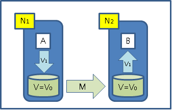
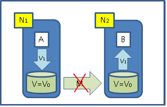

# CAP & NoSQL

## CAP
> " 분산 시스템에서 Consistency, Availability, Tolerance of network partition 이 세가지 특성을 모두 만족하기는 불가능하다 " (두가지만 취할 수 있다.)
> -- 2000년 Eric Brewer 세운 가설이고 이후 증명 되었다.

- CAP 이론

	

	- Consistency
		- ACID 의 C 가 아님.
		- CAP 의 C 는 "Single request / response operation sequence" 의 속성을 나타낸다.
		- 모든 노드가 같은 시간에 같은 데이터를 보여줘야 한다. (저장된 데이터까지 모두 같을 필요는 없다)
	- Availability
    	- 특정 노드가 장애가 나도 서비스가 가능해야 한다
		- 데이터 저장소에 대한 모든 동작(read, write 등)은 항상 성공적으로 리턴되어야 한다. - 성능? fail return?
	- Tolerance to network Partitions
		- 노드간에 통신 문제가 생겨서 메시지를 주고받지 못하는 상황이라도 동작해야 한다.
		- Availablity와의 차이점은 Availability는 특정 노드가 “장애”가 발생한 상황에 대한 것이고 Tolerance to network Partitions는 노드의 상태는 정상이지만 네트워크 등의 문제로 서로간의 연결이 끊어진 상황에 대한 것이다.

- CAP 이해 / 적용
	> 네트웍이 N1, N2로 구분된 분산환경이다.
    > 각 DB 노드는 V=V0 이라는 값을 가지고 있다.
    > 각 네트워크에는 A, B라는 클라이언트가 존재한다.
    >  A는 V=V1이라고 쓰고 B가 그것을 읽는다.

         

    1. “C”가 꼭 필요한 상황인 경우
		– A가 V1이라고 썼기 때문에 B는 V1이라고 읽을 수 있어야만 한다.
		– A의 쓰기 동작은 M이 복구되기 전까지는 성공할 수 없다.
		– M이 복구되기 전까지는 A의 Write는 block되거나 실패해야 한다. = Availability가 없음 = CP
		– M이 문제가 생길 수 없도록 구성 = Partition-Tolerance가 필요 없음 = CA

	2. “A”가 꼭 필요한 상황인 경우
		– 어떤 경우에도 서비스가 Unavailable하면 안된다.
		– A와 B가 꼭 동일한 데이터를 읽을 필요는 없음 = AP
		– M이 문제가 생길 수 없도록 구성 = Partition-Tolerance가 필요 없음 = CA

	3. “P”가 꼭 필요한 상황인 경우
		– 메시지 전달 과정(M)에서 문제가 생기더라도 시스템에 영향이 가서는 안된다.
		– A와 B가 꼭 동일한 데이터를 읽을 필요는 없음 = AP
		– A의 쓰기 동작은 M이 복구되기를 기다린다. = 그동안 쓰기 서비스 불가능 = Availability가 없음 = CP

-  ACID ??
	- dbms 의 transaction 이 안전하고 정확하게 수행되기 위해 만족해야 할 특성을 정의

    [출처 - 위키피디아]

		- Atomicity (원자성) - 트랜잭션은 어떠한 상황에서도 보장 된다.
			: 트랜잭션은 부분적으로 실행되다가 중단되지 않는 것을 보장 해야 한다.
            예를 들어 은행 계좌의 경우 이체는 성공 할 수 도 실패 할 수도  있지만,
            보내는 쪽에서 돈을 빼오는 것만 성공하고 받는 쪽에 넣는 작업을 실패 해서는 안된다.
            이와 같이 원자성은 중간 단계까지 실행되고 실패하는 일이 없도록 해야 하는것.

		- Consistency (일관성) - 모든 제약조건은 지켜진다.
			: 트랜잭션이 실행을 성공적으로 완료되면, 일관된 상태로 유지하는것을 의미한다.
            무결성 제약으로 모든 계좌는 잔고가 있어야 한다면 이를 위반하는 트랜잭션은 중단된다.

		- Isolation (고립성) -
			: 트랜잭션의 수행 시 다른 트랜잭션의 연산이 끼어들지 못하도록 보장하는것.
            이것은 트랜잭션 밖에 있는 어떤 연산도 중간단계의 데이터를 볼 수 없음을 의미한다.
            예를 들어, 은행 관리자는 이체 작업을 하는 도중에 쿼리를 실행하더라도
            특정 계좌간 이체하는 양쪽을 볼 수 없다.

		- Durability (지속성) - 데이터의 무결성을 지킨다.
			: 성공적으로 수행된 트랜잭션은 영원히 반영 되어야 함을 의미한다.
            시스템에 문제가 발생하더라도 모든 트랜잭션은 로그로 남고 시스템 장애 발생전 상태로 되돌릴 수 있다.
            트랜잭션은 로그에 모든것이 저장된 후에만 commit 상태로 간주 될 수 있다.

	- ACID 의 네가지 속성은 RDBMS 의 기본적이고 전통적인 트랜잭션의 정의
	- 일반적으로 commit savepoint rollback 을 지원하며,
	- 제약조건을 지켜야 만 한다.
	- MVCC 가 당연히 필요
	- 응용은 트랜잭션을 신뢰 할 수 있어야 한다.
